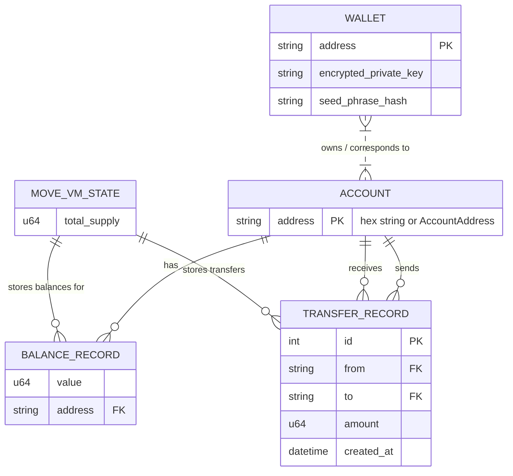

**System Entity-Relationship (ER) — Kanari Codebase**

This document describes the main entities, their attributes, and relationships in the Kanari codebase (Move + Rust). It also maps each entity to the code files where the data structures and operations are implemented.

---

## High-level summary

- The system is a Move-based token transfer platform. Runtime state is persisted in a Rust-managed `MoveVMState` (RocksDB) and many behaviors (validation, transfer record creation) are delegated to Move modules when loaded.
- Primary runtime artifacts live in:
  - Rust crates: `crates/kanari`, `crates/kanari-move-runtime`, `crates/kanari-types`, `crates/kanari-crypto`.
  - Move package: `crates/kanari-frameworks/packages/kanari-system/sources` (compiled to `.mv` files under `build/`).

---

## ER Diagram (Mermaid)



Notes on cardinality:

- An `ACCOUNT` (Move `AccountAddress`) has exactly one `BalanceRecord` in the current state model (the HashMap keyed by address). The ER uses 1-to-many notation to allow for conceptual extension.
- `TRANSFER_RECORD` references two `ACCOUNT` rows (from / to). Transfers are append-only in the `MoveVMState.transfers` vector.

---

## Entity definitions & code mappings

- Account
  - Representation: `move_core_types::account_address::AccountAddress` and hex strings in maps.
  - Code: used throughout; `kanari_types::address::Address` and conversion helpers.

- Wallet
  - Representation: encrypted wallet files managed by `crates/kanari-crypto`.
  - Code: `crates/kanari-crypto/src/wallet.rs` and `crates/kanari/src/main.rs` (Create/Load commands).

- BalanceRecord
  - Representation: `crates/kanari-types/src/balance.rs::BalanceRecord` (u64 MIST value, helpers increase/decrease).
  - Persistence: `MoveVMState.accounts: HashMap<String, BalanceRecord>` in `crates/kanari-move-runtime/src/move_vm_state.rs`.

- TransferRecord
  - Representation: `crates/kanari-types/src/transfer.rs::TransferRecord` currently holds `AccountAddress` for `from` and `to`, and `amount: u64`.
  - Appended to: `MoveVMState.transfers: Vec<TransferRecord>` in `crates/kanari-move-runtime/src/move_vm_state.rs`.
  - Creation: Preferably produced by Move via `MoveRuntime.create_transfer_record`, but stored as Rust struct for persistence and querying.

- MoveVMState
  - Representation: `crates/kanari-move-runtime/src/move_vm_state.rs::MoveVMState` (accounts map, transfers vec, total_supply u64).
  - Persistence: Serialized via `serde_json` and stored in RocksDB under `~/.kari/kanari-db/move_vm_db` (key `b"state"`).

- Move Modules & Runtime
  - Representation: Move bytecode modules live as `.mv` files under the Move package build output.
  - Runtime: `crates/kanari-move-runtime/src/move_runtime.rs` wraps the Move VM and exposes helpers: `validate_transfer`, `create_transfer_record`, `get_transfer_amount`, `load_module`, etc.

---

## Important workflows and where they touch the ER model

- Genesis / bootstrap
  - Where: `crates/kanari/src/main.rs` (first-run bootstrap). If `MoveVMState.get_total_supply() == 0` then `state.mint(dev_addr, TOTAL_SUPPLY_MIST)`.
  - Effect: creates an `Account` (dev address) and sets its `BalanceRecord.value` to initial supply; sets `MoveVMState.total_supply`.

- Create wallet
  - Where: `crates/kanari/src/main.rs` (CreateWallet). Generates a keypair via `kanari-crypto`, saves wallet file, and registers the account in `MoveVMState` via `create_account`.
  - Effect: creates Wallet file; `MoveVMState.accounts` entry inserted with zero `BalanceRecord`.

- Signed Transfer
  - Where: `crates/kanari/src/main.rs` -> calls `state.transfer(&mut runtime, from, to, amount_mist)`.
  - Steps touching ER:
    1. Verify sender `BalanceRecord.value` is sufficient.
    2. Call `MoveRuntime.validate_transfer` to run Move validation logic (optional if modules loaded).
    3. Call `MoveRuntime.create_transfer_record` to get a transfer struct from Move and verify `get_transfer_amount`.
    4. Update `from` and `to` `BalanceRecord.value` and append `TransferRecord` to `MoveVMState.transfers`.

---

## Quick developer commands (how to inspect entities)

- List wallets (shows addresses and formatted balances):

```powershell
cargo run -p kanari -- list-wallets
```

- Show wallet info:

```powershell
cargo run -p kanari -- wallet-info --address 0x... --password <pw>
```

- Run Move package tests / build via `kanari` wrapper (calls in-repo `move-cli`):

```powershell
cargo run -p kanari -- move test
cargo run -p kanari -- move new my_package
```

---

## Next steps / suggested improvements

- Add a `status` CLI command that prints `MoveVMState.total_supply` and non-zero balances for quick inspection.
- Consider moving genesis into a Move-level `kanari::init` function and invoke it via `MoveRuntime` so the mint process is governed by Move module logic rather than Rust-side seeding.
- Add a JSON-friendly serializer for `TransferRecord` (serialize `AccountAddress` as hex strings) for external APIs.

---

File saved: `DOCS/SYSTEM_ER.md`
